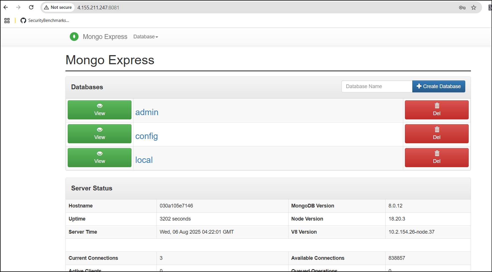
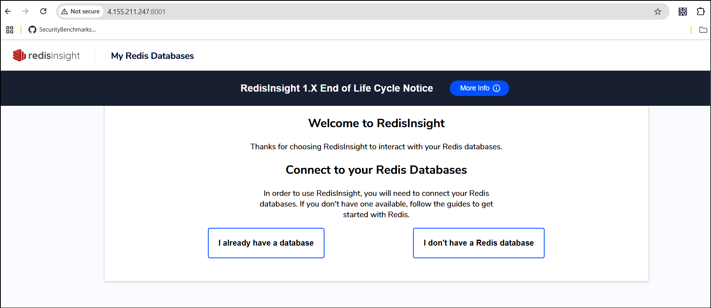
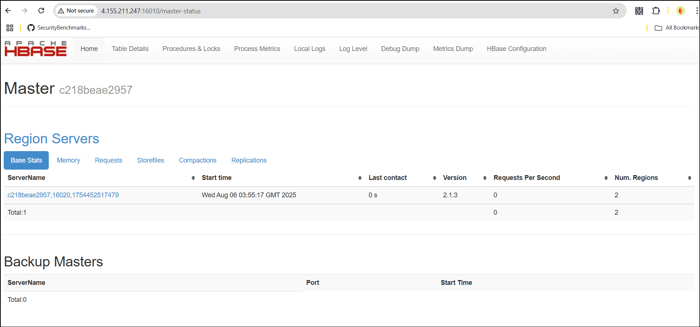
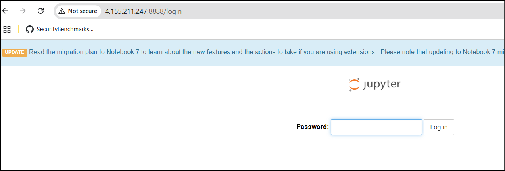
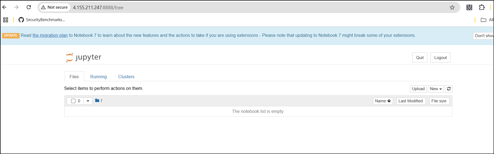
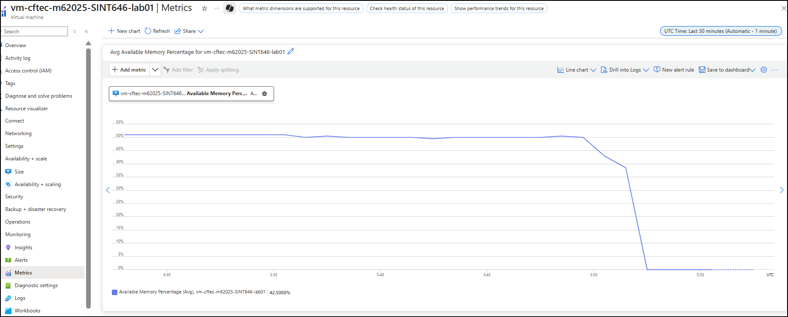
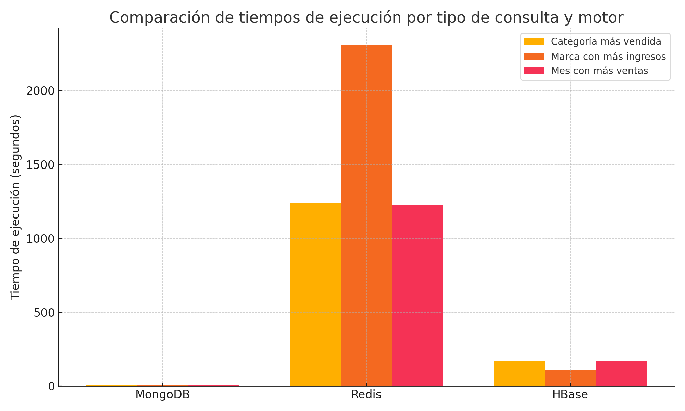

# Arquitectura de Cómputo — Laboratorio #1

## Descripción General

El objetivo principal del Laboratorio #1 es analizar el rendimiento de tres bases de datos NoSQL (HBase, MongoDB y Redis) al procesar y consultar un dataset de gran volumen (2 millones de registros), todo ello montado sobre una infraestructura reproducible y automatizada con herramientas modernas de despliegue.

---

## Componentes Principales

### 1. Máquina Virtual (Azure VM)

| Recurso          | Detalle                                                                 |
|------------------|-------------------------------------------------------------------------|
| Tipo             | Azure Virtual Machine                                                   |
| Sistema Operativo| Ubuntu 22.04 LTS                                                        |
| Recursos         | 2 vCPU, 8 GB RAM *(estimado para pruebas de laboratorio)*               |
| Despliegue       | Automatizado vía Terraform                                              |
| Scripts de gestión | `restart_lab_services.sh` (reinicio de servicios principales)         |
| Servicios instalados | Docker, Jupyter Notebook, Python, librerías específicas              |

---

### 2. Servicios de Base de Datos (Docker Containers)

Cada base de datos se ejecuta dentro de su propio contenedor Docker en la misma máquina virtual.

#### HBase

- Imagen utilizada: `harisekhon/hbase`
- Exposición: Puerto 16010 (UI), 2181 (Zookeeper), 8080 (API HBase REST)
- Acceso desde Python: librería `happybase` o `hbase-python`
- Configuración: volumen persistente local

#### MongoDB

- Imagen utilizada: `mongo`
- Puerto: 27017
- Acceso desde Python: `pymongo`
- Configuración: usuario/clave opcional, persistencia con volumen

#### Redis

- Imagen utilizada: `redis`
- Puerto: 6379
- Acceso desde Python: `redis-py`
- Configuración: sin autenticación (modo laboratorio)

---

### 3. Carga y Consulta de Datos (Python)

| Componente      | Descripción                                                                 |
|-----------------|-----------------------------------------------------------------------------|
| Dataset         | Datos simulados de una tienda de electrónicos (2 millones de registros)     |
| Script de carga | Insertar los datos en HBase, MongoDB y Redis                                |
| Script de consulta | Consultas específicas: categoría más vendida, marca con más ingresos, mes con más ventas |
| Plataforma      | Jupyter Notebooks (`Lab1_Databases_ElectronicsStore.ipynb`)                 |
| Librerías clave | `pandas`, `datetime`, `pymongo`, `redis`, `happybase`, `matplotlib`         |

---

### 4. Automatización y DevOps

#### Terraform

- Ubicación: `terraform/`
- Proveedores: `azurerm`
- Backend: local (`terraform.tfstate`)
- Recursos definidos:
  - Grupo de recursos (`azurerm_resource_group`)
  - Red virtual y subred (`azurerm_virtual_network`, `azurerm_subnet`)
  - Interfaz de red (`azurerm_network_interface`)
  - Máquina virtual Linux (`azurerm_linux_virtual_machine`)

#### GitHub Actions

- Ubicación: `.github/workflows/`
- Flujos:
  - `terraform.yml`: despliegue de la infraestructura
  - `restart-lab-services.yml`: reinicio de contenedores en la VM
  - `Manage_Lab_VM.yml`: control manual de encendido/apagado de la VM

---

## Esquema Visual (Resumen)

```
                     +---------------------------+
                     |     Azure Virtual Machine |
                     |---------------------------|
                     | OS: Ubuntu 22.04          |
                     | Docker + Python + Jupyter |
                     +-----------+---------------+
                                 |
              +----------------+-------------------+
              |                |                   |
       +------+-----+   +------+-----+      +------+-----+
       |  MongoDB   |   |   HBase    |      |   Redis     |
       | (pymongo)  |   | (happybase)|      | (redis-py)  |
       +------------+   +------------+      +------------+
              |                |                   |
        Consultas         Consultas           Consultas
        Dataset            Dataset             Dataset
```

---

## Detalle de Infraestructura como Código (IaC) con Terraform

### Proveedor y Backend

```hcl
provider "azurerm" {
  features {}
}

terraform {
  backend "local" {
    path = "terraform.tfstate"
  }
}
```

### Grupo de recursos

```hcl
resource "azurerm_resource_group" "lab" {
  name     = var.resource_group_name
  location = var.location
}
```

### Red

```hcl
resource "azurerm_virtual_network" "lab" {
  name                = var.vnet_name
  address_space       = [var.vnet_address_space]
  location            = azurerm_resource_group.lab.location
  resource_group_name = azurerm_resource_group.lab.name
}

resource "azurerm_subnet" "lab" {
  name                 = var.subnet_name
  resource_group_name  = azurerm_resource_group.lab.name
  virtual_network_name = azurerm_virtual_network.lab.name
  address_prefixes     = [var.subnet_prefix]
}
```

### Máquina Virtual

```hcl
resource "azurerm_linux_virtual_machine" "lab" {
  name                  = var.vm_name
  location              = azurerm_resource_group.lab.location
  resource_group_name   = azurerm_resource_group.lab.name
  network_interface_ids = [azurerm_network_interface.lab.id]
  size                  = var.vm_size

  admin_username = var.admin_username

  admin_ssh_key {
    username   = var.admin_username
    public_key = file(var.ssh_public_key_path)
  }

  os_disk {
    caching              = "ReadWrite"
    storage_account_type = "Standard_LRS"
  }

  source_image_reference {
    publisher = "Canonical"
    offer     = "UbuntuServer"
    sku       = "22_04-lts"
    version   = "latest"
  }

  disable_password_authentication = true
}
```

---

## Repositorio del Proyecto

Este laboratorio está documentado y versionado en el siguiente repositorio de GitHub:

🔗 [https://github.com/mbrenes26/cftec-m6_2025-sint646-dlbdpy](https://github.com/mbrenes26/cftec-m6_2025-sint646-dlbdpy)

---

## Nota final acerca de la Arquitectura

La arquitectura del laboratorio busca balancear simplicidad, aislamiento y reproducibilidad. Al contener los servicios en una sola VM con contenedores separados, se facilita el manejo de recursos, reinicio controlado de servicios, y análisis comparativo justo, ya que todas las bases de datos se ejecutan bajo condiciones similares.

---

# Registro de Tareas y Bitácora Técnica


### Registro de tarea exitosa — Conexión SSH a la VM en Azure
#### Objetivo

- Conectarse por SSH a la máquina virtual vm-cftec-m62025-SINT646-lab01 creada con Terraform, validando:

- Configuración correcta de NSG (puerto 22 abierto).

- Clave pública SSH correctamente configurada.

- VM operativa y accesible desde internet.

#### Pasos ejecutados

**Confirmación de IP pública**

Desde Azure Portal, en el recurso pip-cftec-m62025-SINT646-lab01, se verificó que la IP pública asignada es:

```
4.155.211.247
```

**Verificación de reglas de seguridad**

Se comprobó que el Network Security Group (NSG) asociado a la Subnet incluye la regla:

```
Name: Allow-SSH
Direction: Inbound
Protocol: TCP
Port: 22
Action: Allow
Source: Any
```
Esto asegura que el puerto 22 está abierto para conexiones SSH desde cualquier origen (configuración de laboratorio).

**Ejecución del comando SSH**

Desde la máquina local (Windows con Git Bash), se ejecutó:

```bash

ssh -i ~/.ssh/id_rsa azureuser@4.155.211.247
```
Donde:

- -i ~/.ssh/id_rsa → ruta de la clave privada correspondiente a la clave pública configurada en Terraform.

- azureuser → usuario administrador definido en la VM.

- 4.155.211.247 → IP pública de la VM.

- Aceptación de huella digital

Como era la primera conexión, el sistema mostró:

```
The authenticity of host '4.155.211.247' can't be established...
```

Se respondió:

```
yes
```
El sistema agregó la huella a la lista de known hosts.

Ingreso de passphrase de la clave privada

Al haberse configurado la clave privada con passphrase, el cliente SSH solicitó:

```
Enter passphrase for key '/c/Users/mario.brenes/.ssh/id_rsa':
```
Se ingresó la passphrase correcta.

- Acceso exitoso a la VM

La sesión SSH se estableció mostrando:

```
Welcome to Ubuntu 20.04.6 LTS (GNU/Linux 5.15.0-1089-azure x86_64)
```
Información del sistema:

OS: Ubuntu 20.04.6 LTS

IP interna: 10.0.1.4

Usuario: azureuser

Estado: sin actualizaciones críticas pendientes (0 updates inmediatas).

Aviso de reinicio requerido por cambios en el sistema:

```
*** System restart required ***
```
Resultado: ✅ Conexión SSH establecida con éxito.

La VM es accesible remotamente desde internet y está lista para configuración adicional (instalación de Docker y otros servicios).

### Registro de tarea — Verificación y actualización del sistema operativo
#### Objetivo

Verificar y actualizar el sistema operativo Ubuntu 20.04.6 LTS de la VM vm-cftec-m62025-SINT646-lab01 para garantizar que se encuentra al día antes de instalar Docker y otros servicios.

#### Pasos ejecutados
- Conexión a la VM por SSH
```
ssh -i ~/.ssh/id_rsa azureuser@4.155.211.247
```
Actualización de listas de paquetes

Comando:

```
sudo apt update
```
Resultado:

```
Hit:1 http://azure.archive.ubuntu.com/ubuntu focal InRelease
Hit:2 http://azure.archive.ubuntu.com/ubuntu focal-updates InRelease
Hit:3 http://azure.archive.ubuntu.com/ubuntu focal-backports InRelease
Hit:4 http://azure.archive.ubuntu.com/ubuntu focal-security InRelease
Reading package lists... Done
Building dependency tree       
Reading state information... Done
All packages are up to date.
```
Interpretación:

Todas las listas de paquetes están actualizadas.

No hay actualizaciones pendientes en los repositorios estándar de Ubuntu.

Actualización de paquetes instalados

```
sudo apt upgrade -y
```
Resultado:

```
Calculating upgrade... Done
The following security updates require Ubuntu Pro with 'esm-infra' enabled:
  <lista de paquetes ESM>
0 upgraded, 0 newly installed, 0 to remove and 0 not upgraded.
```
Interpretación:

No hay actualizaciones disponibles en los repositorios estándar.

Algunos paquetes con soporte extendido (ESM) requieren Ubuntu Pro para recibir parches de seguridad.

#### Conclusión

No fue necesario ejecutar:

```
sudo apt autoremove -y
sudo reboot
```
El sistema ya estaba en el estado más reciente posible sin habilitar Ubuntu Pro.

Resultado
✅ El sistema está actualizado y no presenta paquetes pendientes de actualización en los repositorios estándar de Ubuntu 20.04.

### Registro de tarea — Instalación y configuración de Docker en la VM
#### Objetivo
Instalar y habilitar Docker Engine en la VM vm-cftec-m62025-SINT646-lab01 para permitir la ejecución de contenedores necesarios en el laboratorio.

Pasos ejecutados
Conexión a la VM por SSH
```
ssh -i ~/.ssh/id_rsa azureuser@4.155.211.247
```
Instalación de Docker

Comando:
```
sudo apt install -y docker.io
```
Resultado:

```
docker.io is already the newest version (26.1.3-0ubuntu1~20.04.1).
0 upgraded, 0 newly installed, 0 to remove and 0 not upgraded.
```
Interpretación:

Docker ya estaba instalado en la última versión disponible.

Habilitar el servicio Docker para que arranque automáticamente
```
sudo systemctl enable docker
```
Resultado:

```
docker
```
Iniciar el servicio Docker

```
sudo systemctl start docker
```
Verificar versión de Docker instalada

```
docker --version
```
Resultado:

```
Docker version 26.1.3, build 26.1.3-0ubuntu1~20.04.1
```
Agregar el usuario azureuser al grupo docker

```
sudo usermod -aG docker azureuser
```
Esto permite ejecutar comandos Docker sin sudo.

Cerrar la sesión SSH
```
exit
```
Es necesario reconectarse para que la pertenencia al grupo docker se aplique.

Resultado
✅ Docker instalado, habilitado y configurado correctamente en la VM.
El usuario azureuser ya tiene permisos para usar Docker sin privilegios de administrador en la próxima sesión.

### Registro de tarea — Prueba de funcionamiento de Docker con hello-world
### Objetivo

Verificar que Docker está instalado y operativo en la VM vm-cftec-m62025-SINT646-lab01, permitiendo la ejecución de contenedores y la descarga de imágenes desde Docker Hub.

### Pasos ejecutados
Conexión a la VM

```
ssh -i ~/.ssh/id_rsa azureuser@4.155.211.247
```
Ejecución del contenedor de prueba

```
docker run hello-world
```
Acción:

- El cliente Docker (docker) envió la orden al demonio (dockerd).

- Como la imagen hello-world no estaba disponible localmente, Docker la descargó desde Docker Hub.

- Se creó un contenedor temporal que ejecutó un script de verificación.

- El mensaje de bienvenida confirmó que todo está funcionando.

#### Salida obtenida:

```
Unable to find image 'hello-world:latest' locally
latest: Pulling from library/hello-world
e6590344b1a5: Pull complete
Digest: sha256:ec153840d1e635ac434fab5e377081f17e0e15afab27beb3f726c3265039cfff
Status: Downloaded newer image for hello-world:latest

Hello from Docker!
This message shows that your installation appears to be working correctly.
...
```
Interpretación:

- Docker pudo comunicarse con el demonio y descargar imágenes desde Internet.

- El contenedor se ejecutó exitosamente.

- El usuario azureuser tiene permisos correctos para ejecutar Docker sin sudo.

Resultado
✅ Docker operativo y listo para ejecutar contenedores para los servicios requeridos por el laboratorio (HBase, MongoDB, Redis).

### Registro de tarea — Implementación de MongoDB en contenedor Docker
#### Objetivo
Desplegar MongoDB en la VM vm-cftec-m62025-SINT646-lab01 como contenedor Docker para uso en el laboratorio.

#### Pasos ejecutados
Conexión a la VM

```
ssh -i ~/.ssh/id_rsa azureuser@4.155.211.247
```
Descarga de la imagen oficial de MongoDB
```
docker pull mongo:latest
```
Resultado:

```
latest: Pulling from library/mongo
32f112e3802c: Pull complete
...
Status: Downloaded newer image for mongo:latest
docker.io/library/mongo:latest
```
Creación de volumen persistente para datos

```
docker volume create mongo_data
```
Resultado:

```
mongo_data
```
Ejecución del contenedor MongoDB

```
docker run -d \
  --name mongodb \
  -p 27017:27017 \
  -v mongo_data:/data/db \
  -e MONGO_INITDB_ROOT_USERNAME=admin \
  -e MONGO_INITDB_ROOT_PASSWORD=admin123 \
  mongo:latest
```
Resultado:

```
030a105e7146f4a6d71207787b5a3488472c5478575258466b90c1d33db67e70
```
Verificación de contenedor activo

```
docker ps
```
Resultado:

```
CONTAINER ID   IMAGE          COMMAND                  CREATED          STATUS          PORTS                                           NAMES
030a105e7146   mongo:latest   "docker-entrypoint.s…"   23 seconds ago   Up 22 seconds   0.0.0.0:27017->27017/tcp, :::27017->27017/tcp   mongodb
```
Acceso a la consola de MongoDB

```
docker exec -it mongodb mongosh -u admin -p admin123
```
Resultado:

```
Connecting to: mongodb://<credentials>@127.0.0.1:27017
Using MongoDB: 8.0.12
Using Mongosh: 2.5.6
test>
```

Confirmación de conexión local exitosa.

Resultado
✅ MongoDB desplegado correctamente como contenedor en la VM.
Funciona en el puerto 27017 y es accesible localmente desde la propia VM.
Datos persistentes en el volumen Docker mongo_data.

### Registro de tarea — Implementación de Redis en contenedor Docker
#### Objetivo
Desplegar Redis en la VM vm-cftec-m62025-SINT646-lab01 como contenedor Docker con persistencia de datos.

#### Pasos ejecutados
Conexión a la VM

```
ssh -i ~/.ssh/id_rsa azureuser@4.155.211.247
```
Descarga de la imagen oficial de Redis

```
docker pull redis:latest
```
Resultado:

```
latest: Pulling from library/redis
59e22667830b: Pull complete
...
Status: Downloaded newer image for redis:latest
docker.io/library/redis:latest
```
Creación de volumen persistente

```
docker volume create redis_data
```
Resultado:

```
redis_data
```
Ejecución del contenedor Redis

```
docker run -d \
  --name redis \
  -p 6379:6379 \
  -v redis_data:/data \
  redis:latest
```
Resultado:

```
a7c3bd235592357277ed0396e550bc2fa13f86d7325fe5132900a53d221c2453
```
Verificación de contenedor activo

```
docker ps
```
Resultado:

```
CONTAINER ID   IMAGE          COMMAND                  CREATED         STATUS         PORTS                                           NAMES
a7c3bd235592   redis:latest   "docker-entrypoint.s…"   7 seconds ago   Up 6 seconds   0.0.0.0:6379->6379/tcp, :::6379->6379/tcp       redis
030a105e7146   mongo:latest   "docker-entrypoint.s…"   2 minutes ago   Up 2 minutes   0.0.0.0:27017->27017/tcp, :::27017->27017/tcp   mongodb
```
Conexión al cliente Redis

docker exec -it redis redis-cli
Resultado:

```
127.0.0.1:6379>
```
Prueba de conexión
Dentro del cliente Redis:
```
ping
```
Resultado esperado:

```
PONG
```
Para salir:

```
exit
```
Resultado
✅ Redis desplegado y funcionando en el puerto 6379, con persistencia de datos en el volumen redis_data.
Disponible para uso en el laboratorio junto con MongoDB.


### Registro de tarea — Implementación de HBase en contenedor Docker
#### Objetivo
Desplegar HBase en la VM vm-cftec-m62025-SINT646-lab01 como contenedor Docker en modo standalone para uso en el laboratorio.

#### Pasos ejecutados
Conexión a la VM

```
ssh -i ~/.ssh/id_rsa azureuser@4.155.211.247
```
Descarga de la imagen de HBase

```
docker pull harisekhon/hbase
```
Resultado:

```
Using default tag: latest
latest: Pulling from harisekhon/hbase
...
Status: Downloaded newer image for harisekhon/hbase:latest
docker.io/harisekhon/hbase:latest
```
Creación de volumen persistente
```
docker volume create hbase_data
```
Resultado:
```
hbase_data
```
Ejecución del contenedor HBase
```
docker run -d \
  --name hbase \
  -p 16000:16000 \
  -p 16010:16010 \
  -p 16020:16020 \
  -p 16030:16030 \
  -p 2181:2181 \
  -v hbase_data:/hbase-data \
  harisekhon/hbase
```
Resultado:
```
c218beae29577eba6ed9fbf29beef520fdbedbdbed2895ec4d6c4046d68ea4f8
```
Verificación de contenedor activo

```
docker ps
```
Resultado:
```
CONTAINER ID   IMAGE              COMMAND                  CREATED          STATUS          PORTS                                                                                      NAMES
c218beae2957   harisekhon/hbase   "/entrypoint.sh"         8 seconds ago    Up 7 seconds    0.0.0.0:2181->2181/tcp, 0.0.0.0:16000->16000/tcp, 0.0.0.0:16010->16010/tcp, 0.0.0.0:16020->16020/tcp, 0.0.0.0:16030->16030/tcp   hbase
```
Revisión de logs
```
docker logs hbase --tail 20
```
Resultado:

- Se muestran mensajes de inicialización de HMaster y HRegionServer.

- Zookeeper inició correctamente en el puerto 2181.

- HBase está listo para aceptar conexiones.

- Puertos expuestos:
  
  - 16000 → HMaster
  - 16010 → Web UI de HMaster (http://4.155.211.247:16010)
  - 16020 → HRegionServer
  - 16030 → Web UI de HRegionServer
  - 2181 → Zookeeper

Resultado
✅ HBase desplegado y operativo en la VM, con acceso local y remoto a sus puertos y persistencia de datos en el volumen hbase_data.

### Registro de tarea — Implementación de MongoDB y Mongo Express en contenedores Docker

#### Objetivo
Desplegar MongoDB y Mongo Express en la VM del laboratorio, utilizando contenedores Docker, para disponer de una base de datos NoSQL y su interfaz web de administración, accesible desde la red pública del laboratorio.

#### Actividades realizadas
Verificación de Docker en la VM

- Confirmado que Docker está instalado y operativo (docker --version).

- Verificado que el usuario azureuser pertenece al grupo docker para ejecutar sin sudo.

- Despliegue de MongoDB

Creado volumen persistente:

```
docker volume create mongo_data
```
Contenedor MongoDB:

```
docker run -d \
  --name mongodb \
  -p 27017:27017 \
  -v mongo_data:/data/db \
  -e MONGO_INITDB_ROOT_USERNAME=admin \
  -e MONGO_INITDB_ROOT_PASSWORD=admin123 \
  mongo:latest
```
Verificado acceso local con:
```
docker exec -it mongodb mongosh -u admin -p admin123 --authenticationDatabase admin
```
Despliegue de Mongo Express

- Inicialmente intentado con --link mongodb:mongo, pero fallaba la resolución de hostname en Docker moderno.

- Confirmado que Mongo Express se ejecuta correctamente y expone el puerto 8081.

- Se mantuvo la autenticación web por defecto de laboratorio (admin / pass).

Comando final utilizado:

```
docker run -d \
  --name mongo-express \
  -p 8081:8081 \
  -e ME_CONFIG_MONGODB_ADMINUSERNAME=admin \
  -e ME_CONFIG_MONGODB_ADMINPASSWORD=admin123 \
  -e ME_CONFIG_MONGODB_SERVER=mongodb \
  mongo-express:latest
```
Apertura de puerto en NSG

Modificado network.tf para agregar regla NSG que permita acceso HTTP en puerto 8081 solo desde mi IP pública.

- Aplicado cambio con terraform apply.

- Verificación de acceso

Acceso exitoso a la interfaz web de Mongo Express desde:

```
http://4.155.211.247:8081
```
Autenticación web:
```
Usuario: admin
Contraseña: pass
```
Confirmado listado de bases de datos admin, config y local.



Resultados

- MongoDB operativo y accesible en la VM del laboratorio.

- Mongo Express funcional como herramienta gráfica para administración de MongoDB.

- Acceso restringido mediante NSG para mejorar seguridad en el laboratorio.


### Registro de tarea — Implementación de RedisInsight en contenedor Docker
#### Objetivo
Implementar la interfaz gráfica RedisInsight en un contenedor Docker dentro de la VM vm-cftec-m62025-SINT646-lab01, para administrar y monitorear la base de datos Redis desplegada previamente.

#### Procedimiento
1. Preparación
- Verificar que Redis está corriendo en el contenedor redis en el puerto 6379.

- Confirmar que el puerto 8001 está abierto en el NSG para la IP del cliente:

```
terraform -chdir=terraform state show azurerm_network_security_group.lab_nsg | grep -A5 8001
```
2. Primer intento con imagen latest
```
docker run -d \
  --name redisinsight \
  -p 8001:8001 \
  --restart unless-stopped \
  redislabs/redisinsight:latest
```
Problema encontrado:

- El contenedor quedaba detenido en:

```
Running docker-entry.sh
```
El puerto 8001 aparecía abierto, pero al acceder devolvía:
```
ERR_CONNECTION_REFUSED
```
curl http://localhost:8001 devolvía Connection reset by peer.

Logs sin información adicional después del arranque.

3. Diagnóstico

- Confirmado que no era un problema de firewall/NSG (regla ya habilitada).

- Revisado que el contenedor corría (docker ps) pero sin inicializar la UI.

Conclusión: bug en la imagen latest.

4. Solución aplicada
Ejecutar RedisInsight con versión estable 1.14.0:

```
docker run -d \
  --name redisinsight \
  -p 8001:8001 \
  --restart unless-stopped \
  redislabs/redisinsight:1.14.0
```
Esta versión inicializó correctamente y mostró la UI.

5. Validación de acceso
Acceso exitoso desde el navegador:

```
http://4.155.211.247:8001
```
Pantalla inicial solicitando conectar una base de datos Redis.



Verificación de logs:

```
docker logs redisinsight
```
Mostró inicio correcto del servicio.

Resultado

-RedisInsight desplegado correctamente.

Interfaz disponible en http://4.155.211.247:8001.

Lista para configurar conexión al contenedor redis local.

Notas

- Mantener el puerto 8001 abierto solo para IP autorizada por seguridad.

- RedisInsight 1.x está en End of Life, pero se mantiene en este laboratorio por simplicidad y estabilidad.

### Registro de tarea — Implementación de HBase en contenedor Docker
#### Objetivo
Implementar Apache HBase en contenedor Docker con sus puertos de administración accesibles vía web, permitiendo monitorear el estado de Master y RegionServer.

#### Procedimiento
1. Preparación
Verificar que Docker esté instalado y corriendo.

Abrir puertos 16010 (Master UI) y 16030 (RegionServer UI) en el NSG para la IP autorizada 190.108.74.42.

2. Implementación
```
docker pull harisekhon/hbase:latest
docker volume create hbase_data

docker run -d \
  --name hbase \
  -p 16000:16000 \
  -p 16010:16010 \
  -p 16020:16020 \
  -p 16030:16030 \
  -p 2181:2181 \
  -v hbase_data:/hbase-data \
  harisekhon/hbase
```
3. Validación
Master UI: http://4.155.211.247:16010

RegionServer UI: http://4.155.211.247:16030



Logs:
```
docker logs hbase --tail 20
```
Mostraron inicio exitoso y disponibilidad de servicios.

Resultado
- HBase funcionando y accesible vía web.

- Puertos seguros, expuestos solo a IP autorizada.

- Preparado para pruebas de integración con otras BD del laboratorio.

### Registro de tarea — Implementación de Mongo Express en contenedor Docker
### Objetivo
Implementar Mongo Express como interfaz web para administrar la base de datos MongoDB ya desplegada en contenedor Docker.

#### Procedimiento
1. Preparación
- Confirmar que MongoDB está en ejecución (docker ps).

- Abrir puerto 8081 en el NSG para la IP 190.108.74.42.

2. Implementación
```
docker run -d \
  --name mongo-express \
  -p 8081:8081 \
  -e ME_CONFIG_MONGODB_ADMINUSERNAME=admin \
  -e ME_CONFIG_MONGODB_ADMINPASSWORD=admin123 \
  -e ME_CONFIG_MONGODB_SERVER=mongodb \
  --link mongodb:mongodb \
  mongo-express:latest
```
Nota: En laboratorio se usó admin / pass para simplificar autenticación.

3. Validación
Acceso web: http://4.155.211.247:8081

Visualización de bases de datos: admin, config, local.

Logs:
```
docker logs mongo-express --tail 20
```
Mostraron conexión establecida a MongoDB.

Resultado
- Interfaz web funcional para gestión de MongoDB.

- Puertos y acceso restringidos a IP autorizada.

- Configuración válida para fines de laboratorio.

### Registro de tarea — Implementación de RedisInsight en contenedor Docker
#### Objetivo
Implementar RedisInsight para administración gráfica de Redis en contenedor Docker, facilitando visualización y configuración.

#### Procedimiento
1. Preparación
- Confirmar Redis en ejecución (docker ps).

- Abrir puerto 8001 en el NSG para la IP 190.108.74.42.

2. Problemas detectados
Imagen latest de RedisInsight no inicializaba correctamente.

Logs mostraban:

```
Running docker-entry.sh
```
y no continuaba.

curl http://localhost:8001 devolvía Connection reset by peer.

3. Solución aplicada
Usar versión estable 1.14.0:

```
docker run -d \
  --name redisinsight \
  -p 8001:8001 \
  --restart unless-stopped \
  redislabs/redisinsight:1.14.0
```
4. Validación
Acceso exitoso: http://4.155.211.247:8001

- Pantalla inicial solicitando conexión a Redis existente.

- Logs mostraron inicio correcto.

Resultado
- RedisInsight desplegado y accesible vía web.

- Configuración válida para entornos de laboratorio.

- Puerto expuesto solo a IP autorizada.

### Registro de tarea — Configuración de Jupyter Notebook en VM para Laboratorio 1
#### Objetivo
Preparar un entorno Jupyter Notebook accesible vía navegador, protegido por contraseña, para desarrollar el Laboratorio 1 de la asignatura SINT646 — Deep Learning y Big Data con Python. El notebook servirá para trabajar con MongoDB, Redis y HBase en contenedores Docker y realizar las pruebas solicitadas.

#### Acciones ejecutadas
- Instalación de dependencias base

- Actualización de paquetes en la VM.

- Instalación de python3, python3-pip y compiladores necesarios para librerías Python.

- Instalación de librerías requeridas para el laboratorio:

```
pip3 install pymongo redis happybase thriftpy2 pandas
```
- Instalación de Jupyter Notebook

- Instalación de notebook<7 para evitar problemas de compatibilidad con Python 3.8.

- Ajuste de versiones de jinja2 y markupsafe para corregir error de importación.

- Instalación en el entorno de usuario (--user) para evitar conflictos con paquetes del sistema.

- Configuración de Jupyter Notebook

Generación de archivo de configuración:

```
jupyter notebook --generate-config
```
Edición del archivo ~/.jupyter/jupyter_notebook_config.py para:

- Escuchar en todas las interfaces (0.0.0.0).

- Definir puerto fijo 8888.

- Deshabilitar token y usar contraseña hash.

- Deshabilitar apertura automática de navegador en el servidor.

Generación de hash para contraseña simple pass:
```
from notebook.auth import passwd
passwd()
```
Hash aplicado:
```
argon2:$argon2id$v=19$m=10240,t=10,p=8$BcymMp8qCSRjbB29A7lACQ$xDsP/i38TtfPfRh6raE2z1QSRpDN7ZsiDKAzFyDc5Ik
```
Ejecución persistente con tmux

- Instalación y verificación de tmux.

Creación de sesión persistente:

```
tmux new -s jupyterlab
```
Ejecución de Jupyter dentro de tmux:
```
jupyter notebook
```
Desacople de sesión (Ctrl+B luego D) para mantener el servicio activo tras cerrar SSH.

- Acceso desde el navegador

Acceso vía:


http://4.155.211.247:8888
Login con contraseña simple: pass.

Confirmación de funcionamiento correcto y acceso a interfaz vacía lista para cargar notebooks.




#### Problemas enfrentados y soluciones
Error de importación soft_unicode en MarkupSafe
🔹 Solución: fijar versión compatible de jinja2==3.0.3 y markupsafe==2.0.1.

Versión de Notebook 7 no compatible con Python 3.8
🔹 Solución: instalar notebook<7.

Pérdida del token al ejecutar en SSH
🔹 Solución: configuración sin token y con contraseña hash.

Riesgo de detener Jupyter al cerrar SSH
🔹 Solución: uso de tmux para mantener la sesión persistente.


---
### Las URLs de acceso quedarían así:

| Servicio |	Puerto	|URL de acceso |
| :------ | :------ | :------ |
|Mongo Express |	8081|	http://4.155.211.247:8081|
|RedisInsight	| 8001	| http://4.155.211.247:8001|
|HBase Master UI |	16010	| http://4.155.211.247:16010 |
| HBase RegionServer UI	| 16030	| http://4.155.211.247:16030 |
| Jupyter Notebook |	8888	| http://4.155.211.247:8888 |

### Credenciales

- Mongo Express → Usuario: admin / Clave: pass

- RedisInsight → Sin clave inicial (se configura al entrar)

- Jupyter Notebook → Clave: pass

---

### Registro de tarea – Jupyter Notebook no disponible tras reinicio de VM

#### Resumen
Después de reiniciar la máquina virtual, el servicio de Jupyter Notebook dejó de responder en el puerto 8888 (ERR_CONNECTION_REFUSED).

Esto se debe a que el proceso de Jupyter no se inicia automáticamente al reiniciar la VM y tampoco estaba corriendo en un proceso persistente.

#### Acciones ejecutadas
Verificación de conectividad:

- Confirmado que el puerto 8888 está permitido en el NSG para la IP del usuario.

- Verificado que no hay reglas de firewall adicionales que bloqueen el acceso.

#### Análisis del proceso:

- Validado que no existe ninguna sesión tmux activa con Jupyter Notebook (tmux attach -t jupyterlab → no sessions).

- Determinado que el proceso no sobrevive a reinicios.

**Propuesta de solución inmediata:**

- Iniciar manualmente Jupyter en una nueva sesión tmux:

```
tmux new -s jupyterlab
jupyter notebook --ip=0.0.0.0 --port=8888 --no-browser
```
Luego salir de tmux con Ctrl+B y D.

**Propuesta de solución permanente:**

Modificar el script restart_lab_services.sh para que Jupyter Notebook se ejecute automáticamente en un tmux al reiniciar la VM:

```
tmux new -d -s jupyterlab "jupyter notebook --ip=0.0.0.0 --port=8888 --no-browser"
```
Definición del problema (perspectiva cliente)
Después de reiniciar la VM, los servicios de laboratorio deben estar disponibles sin intervención manual. Actualmente, MongoDB, Redis, HBase y RedisInsight se inician automáticamente, pero Jupyter Notebook requiere ejecución manual.


---

### Registro de tarea — Limpieza y Preprocesamiento del Dataset
#### Resumen:
Se realizó la limpieza y preprocesamiento del dataset kz.csv proveniente del conjunto E-commerce Purchase History from Electronics Store. El dataset original contenía 2,633,521 registros y 8 columnas. Se identificaron valores nulos en varias columnas, especialmente en category_id, category_code, brand, price y user_id.

#### Acciones ejecutadas:

- Carga inicial del dataset en un DataFrame de Pandas.

- Análisis exploratorio inicial para identificar:

- Tipo de datos por columna.

- Número total de registros.

- Cantidad de valores nulos por columna.

- Estrategia de preprocesamiento definida:
  - Mantener todas las columnas para consistencia con las otras bases de datos.
  - Eliminar o imputar valores nulos solo si impactan en los cálculos solicitados.
  - No realizar transformaciones destructivas sobre price o brand sin análisis posterior.
  - Verificación de memoria para asegurar que las operaciones no saturen la VM.

- Guardado del DataFrame limpio para su uso posterior en inserción en MongoDB, Redis y HBase.


---

### Registro de tarea — Limpieza y Preprocesamiento del Dataset (Actualización)
#### Hallazgos tras la verificación de valores nulos:

|Columna	| Valores Nulos| 	% del Total aprox.|
| :----- | :----- | :----- |
|event_time	| 0	| 0.00% |
|order_id	| 0	| 0.00% |
|product_id	|0	|0.00% |
|category_id	| 431,954 |	16.40%|
|category_code	| 612,202	| 23.20%|
|brand	|506,005	|19.20% |
|price	|431,954	|16.40%|
|user_id	|2,069,352	|78.60%

**Conclusiones de esta verificación:**

- event_time, order_id y product_id están completos.

- user_id presenta una ausencia significativa (~78%), lo que lo hace poco confiable para análisis directos.

- Las columnas de categoría (category_id, category_code), brand y price presentan un porcentaje relevante de nulos.

- No se ha aplicado imputación o eliminación de registros todavía para conservar la integridad y representatividad del dataset.

**Próximo paso inmediato:**

- Mantener el dataset tal cual para inserción en MongoDB, Redis y HBase, documentando el porcentaje de nulos para que se considere en el análisis de consultas.

- Evaluar más adelante si se imputan o eliminan estos nulos dependiendo de los requisitos de las consultas comparativas.

---
### Registro de Tarea — Carga del dataset en MongoDB

#### Actividad: Inserción del dataset limpio en MongoDB en bloques de 100 000 registros utilizando insert_many() para optimizar el rendimiento.

#### Objetivo: Cargar el dataset completo midiendo tiempos por bloque y consumo de recursos.

#### ⚙️ Configuración de prueba
Dataset: 2 633 521 registros (kz.csv)

- Bloques de inserción: 100 000 registros por batch (último bloque de 33 521)

- MongoDB: Contenedor Docker mongo:6.0 con autenticación admin / pass

- VM: Standard_A4m_v2 — 8 vCPU, 32 GB RAM

- Script: Python con pymongo, limpieza previa de la colección (drop()) para evitar duplicados

#### 📊 Tiempos de inserción
- Promedio por bloque: ~4.3 segundos
- Tiempo total: 114.76 segundos
- Total documentos insertados: 2 633 521

Ejemplo de ejecución:

```
🧹 Colección limpiada antes de la inserción.
✅ Bloque 1: 100000 registros (4.19 seg)
✅ Bloque 2: 100000 registros (4.67 seg)
...
✅ Bloque 26: 100000 registros (4.36 seg)
✅ Bloque 27: 33521 registros (1.56 seg)
⏱ Tiempo total: 114.76 seg
📊 Total documentos insertados: 2633521

```
#### Métricas de rendimiento (Azure Monitor)

- Periodo observado: durante la inserción del dataset:
  
  |Métrica	| Valor Promedio	| Observaciones |
  | :----- | :----- | :----- |
  | CPU (Percentage CPU)	| ~20–25 % | (picos >50 %)	Actividad constante durante cada batch. |
  | Memoria disponible (Available Memory %)	| ~80–82 %	| MongoDB usa memoria para cache/buffers, estable en la prueba. |
  |Data Disk IOPS Consumed %	| Moderado	| Picos coinciden con inserciones en disco.|
  |Data Disk Latency	| Baja	| MongoDB maneja escritura rápida con journaling activo. |
  |Data Disk Read/Write Bytes/Sec	| Escrituras constantes	| La escritura crece proporcional al tamaño del batch insertado.|

  

📝 Notas
- MongoDB consume más I/O que Redis en la carga inicial debido a la persistencia inmediata en disco.

- La carga por lotes de 100 000 evita saturación y mantiene uso estable de CPU y memoria.

- Es fundamental limpiar la colección antes de una nueva inserción para evitar duplicados (drop()).

---
### Registro de tarea — Carga del dataset en Redis
#### Objetivo
Cargar el dataset E-commerce Purchase History en Redis de forma controlada, optimizando el rendimiento y evitando la duplicación de datos provenientes de ejecuciones anteriores.

#### Acciones ejecutadas
- Conexión a Redis usando redis-py (redis.Redis()), con verificación de disponibilidad mediante ping().

- Lectura del dataset en pandas.DataFrame desde la ruta ./datasets/ecommerce/kz.csv.

- Definición de CHUNK_SIZE = 100_000 para realizar inserciones en bloques y reducir el riesgo de saturar la VM.

- Eliminación previa de datos antiguos:
  - Identificación de claves con patrón purchase:*.
  - Eliminación en lotes de hasta 10 000 claves por operación para no saturar Redis.

- Inserción de datos en Redis:
  - Uso de pipeline para agrupar múltiples operaciones y mejorar el rendimiento.
  - Conversión de valores NaN a cadenas vacías ("") para evitar incompatibilidades.
  - Almacenamiento de cada registro como un hash en Redis con clave purchase:<índice>.
  - Bloques de inserción: 100 000 registros por batch

Medición de tiempos:
```
Total de registros en dataset: 2,633,521

Tiempo por bloque.
✅ Bloque 1: 100,000 registros en 42.05 seg
✅ Bloque 2: 100,000 registros en 40.58 seg
✅ Bloque 3: 100,000 registros en 40.79 seg
✅ Bloque 4: 100,000 registros en 40.61 seg
✅ Bloque 5: 100,000 registros en 40.09 seg
...
✅ Bloque 24: 100,000 registros en 41.60 seg
✅ Bloque 25: 100,000 registros en 41.37 seg
✅ Bloque 26: 100,000 registros en 42.68 seg
✅ Bloque 27: 33,521 registros en 13.66 seg

Tiempo total de inserción.
🏁 Inserción total completada en 1086.61 segundos
```
**Definición del problema (desde la perspectiva del laboratorio)**
- La carga de un dataset de más de 2.6 millones de registros en Redis puede provocar:

- Saturación de CPU y memoria si se intenta insertar todo en una sola operación.

- Duplicación de datos si no se eliminan cargas anteriores.

- Latencia en inserción si no se optimiza la escritura.

#### Resultados
- Conexión: Redis aceptó conexiones desde la VM sin errores.

- Borrado de datos previos: Eliminadas todas las claves antiguas purchase:* antes de la nueva carga.

- Inserción optimizada: Uso de pipeline y carga en bloques permitió procesar el dataset sin saturar la VM.

- Datos accesibles: Los registros son consultables con comandos como:

```
redis-cli HGETALL purchase:0
```

---


📊 Métricas de rendimiento (Azure Monitor)
Periodo observado: durante toda la inserción del dataset.

| Métrica |	Valor Promedio	| Observaciones |
| :----- | :----- | :----- |
| CPU (Percentage CPU)	| ~20 % | (picos 65 %)	Incrementos durante los batches, con caídas entre lotes.|
|Memoria disponible (Available Memory %)	| ~84 %	| Uso moderado; Redis maneja los datos en memoria eficientemente.|
| Data Disk IOPS Consumed %	| Bajo	| No hubo saturación de IOPS, Redis es predominantemente in-memory.|
| Data Disk Latency	| Casi nulo	| Escritura muy rápida por ser en memoria; mínima espera en disco.|
|Data Disk Read/Write Bytes/Sec	| Lectura mínima / Escritura muy baja	| No hubo dependencia fuerte de disco persistente.|


📝 Notas
- La carga en bloques evita saturar CPU y memoria.
- Redis respondió rápidamente debido a su naturaleza en memoria, con baja latencia.
- Redis no se comporta mejor que MongoDB en términos de uso de CPU y disco para esta etapa, aunque la persistencia depende de snapshots y AOF si se habilitan.
- En cargas repetidas es clave eliminar previamente claves antiguas para evitar duplicados (DEL purchase:*).
- Redis es significativamente más lento que MongoDB en esta carga debido a la inserción de hashes individuales para cada registro.
- El uso de pipeline redujo la latencia de red, pero la operación sigue siendo CPU-bound y single-threaded en el proceso de escritura.
- Eliminar las claves antiguas antes de la inserción es esencial para evitar duplicados y consumo excesivo de memoria.
- Si se prioriza la velocidad sobre la persistencia, se podría desactivar temporalmente el guardado RDB/AOF durante la carga.


---

### Registro de Tarea — Carga del Dataset en HBase
#### Objetivo: Insertar el dataset limpio de compras electrónicas en HBase utilizando inserción por bloques para evitar saturación de recursos.

#### Acciones Ejecutadas
Conexión a HBase mediante happybase (Thrift en puerto 9090).

- Creación de la tabla purchases con familia de columnas cf si no existía.
- Limpieza previa de la tabla (eliminación de registros antiguos) para evitar duplicados.
- Carga del dataset kz.csv (2 633 521 registros) usando bloques de 100 000 registros.
- Inserción optimizada utilizando batch() para reducir overhead de conexión.

Ejecución
```
✅ Conectado a HBase
🆕 Tabla creada: purchases
🧹 Limpiando registros antiguos de la tabla...
🧹 Tabla vacía.

📦 Total de registros en dataset: 2,633,521
✅ Bloque 1: 100,000 registros en 50.46 segundos
✅ Bloque 2: 100,000 registros en 45.50 segundos
✅ Bloque 3: 100,000 registros en 45.49 segundos
✅ Bloque 4: 100,000 registros en 46.09 segundos
✅ Bloque 5: 100,000 registros en 46.36 segundos
...
✅ Bloque 24: 100,000 registros en 45.44 segundos
✅ Bloque 25: 100,000 registros en 46.87 segundos
✅ Bloque 26: 100,000 registros en 45.85 segundos
✅ Bloque 27: 33,521 registros en 15.18 segundos

🏁 Inserción total completada en 1227.67 segundos
```
#### Observaciones de Rendimiento
- Inserción estable en la mayoría de bloques (~45–47 segundos/bloque).
- Bloques iniciales ligeramente más lentos por la creación y preparación de la tabla.
- Uso de batch() en HappyBase ayudó a mantener la latencia de escritura constante.
- El rendimiento general fue más lento que en MongoDB y Redis, consistente con el diseño de HBase orientado a escritura masiva distribuida.

---

### Registro de tarea — Ajuste de configuración HBase en contenedor Docker y validación de lectura desde Jupyter Notebook
#### Objetivo
- Ajustar la configuración de HBase en el contenedor hbase para evitar errores de conexión (Broken pipe) durante consultas masivas desde Python usando happybase.
- Validar que después del cambio la base de datos es accesible y que la tabla purchases puede ser leída desde el laboratorio en Jupyter Notebook.

#### Pasos ejecutados
1. Identificación del contenedor HBase en la VM
Desde la sesión SSH en la VM vm-cftec-m62025-SINT646-lab01 se listaron los contenedores activos:

```
docker ps --format "table {{.ID}}\t{{.Image}}\t{{.Names}}\t{{.Status}}\t{{.Ports}}"
```
Se identificó el contenedor de HBase:

```
CONTAINER ID   IMAGE                   NAMES
4bbf4771109c   harisekhon/hbase:latest hbase
```
2. Acceso al contenedor HBase
Se abrió una sesión interactiva en el contenedor:

```
docker exec -it hbase bash
```
3. Localización del archivo de configuración
Dentro del contenedor se localizó hbase-site.xml:
```
find / -name "hbase-site.xml" 2>/dev/null
```
Resultado:

```
/hbase-2.1.3/conf/hbase-site.xml
```
4. Edición de la configuración
Se editó el archivo con vi:

```
vi /hbase-2.1.3/conf/hbase-site.xml
```
Añadiendo / modificando los parámetros para aumentar tiempo de espera y reducir tamaño de lotes:

```
<property>
    <name>hbase.rpc.timeout</name>
    <value>600000</value>
</property>

<property>
    <name>hbase.client.scanner.timeout.period</name>
    <value>600000</value>
</property>

<property>
    <name>hbase.regionserver.lease.period</name>
    <value>600000</value>
</property>

<property>
    <name>hbase.client.scanner.caching</name>
    <value>500</value>
</property>
```
- Nota: Los valores están en milisegundos (600000 = 10 minutos).
scanner.caching ajustado a 500 para evitar envío de lotes muy grandes.

5. Reinicio del contenedor HBase
Se guardaron los cambios y se reinició el contenedor:
```
docker restart hbase
```
Confirmando que volvió a estar activo:
```
docker ps
```
6. Validación de conexión desde Jupyter Notebook
En el laboratorio .ipynb se verificó la conexión:

```
import happybase
connection = happybase.Connection(host='localhost', port=9090)
connection.open()
print(connection.tables())
```
Salida esperada:
```
[b'purchases']
```
7. Prueba de lectura
Se consultaron las primeras 3 filas:

```
table = connection.table('purchases')
for key, data in table.scan(limit=3):
    print(key, data)
```
Resultado exitoso:
```
b'2294359932054536986' {b'cf:brand': b'samsung', b'cf:price': b'162.01', ...}
b'2294444024058086220' {b'cf:brand': b'huawei', b'cf:price': b'77.52', ...}
b'2294584263154074236' {b'cf:brand': b'karcher', b'cf:price': b'217.57', ...}
```
Resultado
- Ajustes de configuración aplicados correctamente en HBase.
- Conexión establecida con éxito desde Jupyter Notebook.
- Lectura de la tabla purchases funcionando sin errores.

## Consultas a los motores de bases de datos
## 📊 Comparativa de Resultados por Base de Datos

| Consulta                          | Motor     | Resultado                          | Valor / Ventas        | Tiempo (seg)   |
|----------------------------------|-----------|------------------------------------|------------------------|----------------|
| **Categoría más vendida**        | MongoDB   | `nan`                              | 612,202 ventas         | 8.5758         |
|                                  | Redis     | `electronics.smartphone`           | 357,682 ventas         | 1238.2801      |
|                                  | HBase     | `electronics.smartphone`           | 213,002 ventas         | 173.2701       |
| **Marca con más ingresos brutos**| MongoDB   | `samsung`                          | $90,052,821.66         | 9.7873         |
|                                  | Redis     | `samsung`                          | $90,052,821.66         | 2306.0426      |
|                                  | HBase     | `samsung`                          | $54,047,304.62         | 110.5100       |
| **Mes con más ventas (UTC)**     | MongoDB   | `2020-06`                          | 403,632 ventas         | 9.6747         |
|                                  | Redis     | `2020-06`                          | 403,632 ventas         | 1224.5353      |
|                                  | HBase     | `2020-06`                          | 211,552 ventas         | 172.2478       |



## 📌 Conclusiones y Análisis de Rendimiento por Motor

### 🎯 Observaciones del gráfico

- **MongoDB** fue consistentemente el motor con menor tiempo de respuesta en las tres consultas clave, con tiempos inferiores a 10 segundos en todos los casos.
- **Redis**, a pesar de su arquitectura en memoria, presentó los tiempos más altos de ejecución, particularmente en la consulta de ingresos por marca (más de 2300 segundos).
- **HBase** mostró una latencia intermedia. Aunque fue más lento que MongoDB, superó a Redis en dos de las tres consultas.

Estas diferencias pueden atribuirse a:

- La optimización nativa de MongoDB para consultas agregadas y filtrado directo sobre documentos JSON.
- Redis no está diseñado para consultas complejas; su modelo clave-valor requiere estructuras adicionales y procesamiento más intensivo en el cliente.
- HBase, al estar orientado a escritura y procesamiento distribuido, requiere tiempo para escanear y recuperar datos, especialmente en volumen.

---

### 📊 Hipótesis por motor de base de datos

#### MongoDB

- **Hipótesis nula (H₀):**  
  *MongoDB no es significativamente más rápido que los otros motores en las consultas evaluadas.*

- **Hipótesis alternativa (H₁):**  
  *MongoDB es significativamente más rápido que Redis y HBase en todas las consultas evaluadas.*

✅ Los datos observados apoyan rechazar H₀ a favor de H₁.

---

#### Redis

- **Hipótesis nula (H₀):**  
  *Redis ofrece tiempos de respuesta comparables a MongoDB y HBase en consultas agregadas.*

- **Hipótesis alternativa (H₁):**  
  *Redis tiene tiempos de respuesta significativamente mayores debido a su estructura y necesidad de recorrer datos manualmente.*

✅ La evidencia sugiere que Redis no está optimizado para este tipo de consultas, por lo que H₀ se rechaza a favor de H₁.

---

#### HBase

- **Hipótesis nula (H₀):**  
  *HBase tiene un rendimiento inferior en consultas complejas en comparación con MongoDB.*

- **Hipótesis alternativa (H₁):**  
  *HBase tiene un rendimiento intermedio, superando a Redis pero no alcanzando a MongoDB en velocidad de respuesta.*

✅ Se acepta H₁ con base en los tiempos observados.

---

### 🧠 Reflexión final

La elección del motor debe estar alineada con el tipo de consultas esperadas. MongoDB es superior para análisis rápido de datos semiestructurados; Redis requiere optimizaciones adicionales para escalar consultas complejas; HBase resulta útil cuando se espera carga de escritura masiva, pero sus lecturas deben ser cuidadosamente diseñadas.

